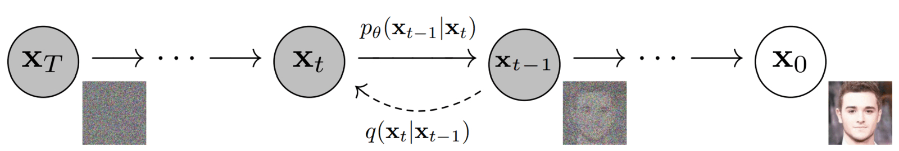
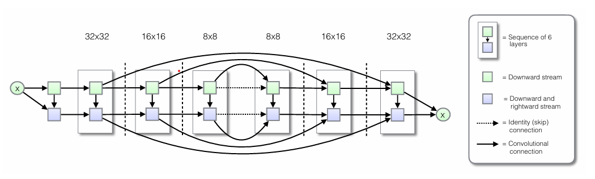
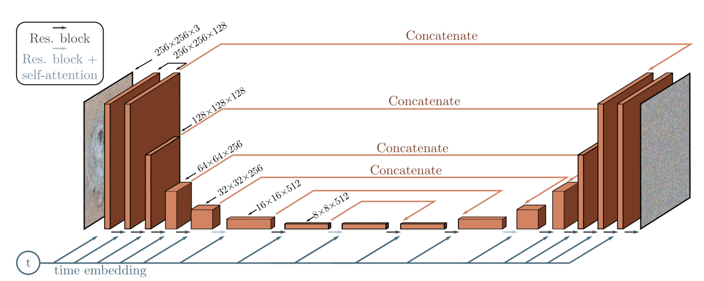
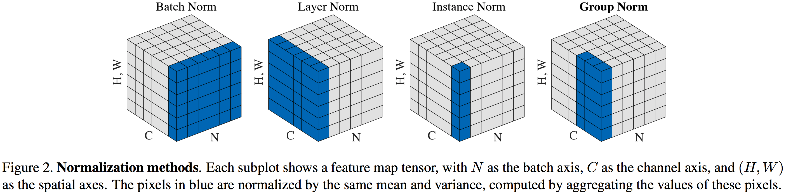

# Diffusion models

Denoising Diffusion Probabilistic Models were first introduced in 2020 in the original paper "[Denoising Diffusion Probabilistic Models - Ho, Jain and Abbeel](https://arxiv.org/abs/2006.11239)" as a powerful class of deep learning generative models, demonstrating impressive results on image, video and audio generation, as well as in one molecule synthesis, and any domain that benefits from synthetic data generation. They have since become the foundation of most generative models we see today, such as DALL-E 3 (OpenAI), Sora (OpenAI) and Imagen 3 (Google).

The aim here is to give a Pytorch demonstration of what diffusion models are capable of, by training a relatively small prediction noise neural network engine, but also to get a solid understanding of how these models operate under the hood, and the brilliancy behind its simplicity. For reference, the official implementation of diffusion models is accessible here: [Official GitHub Repository](https://github.com/hojonathanho/diffusion). In addition, the implementation provided here is based heavily on this [Repository](https://github.com/lucidrains/denoising-diffusion-pytorch)

## Concept 
The idea consists on smoothly perturbating the original image data $x_0$ by iteratively adding Gaussian noise until reaching pure noise $x_T$, then learning to reverse this process to generate new data from pure noise. Here is what noising looks like:

### Forward Diffusion:

Let:
- $x_0$ be an image sampled from a distribution $q$
- $\beta_1, \dots, \beta_T \in (0, 1)$ be a list of scalars

The forward diffusion process for $t = 1, 2, \dots, T$ is defined as:

$$q(x_t \mid x_{t-1}) = \mathcal{N}(x_t ; \sqrt{1 - \beta_t}\, x_{t-1},\ \beta_t \mathbf{I})$$

**Properties:**
- The diffusion process is a Markov chain, meaning the noised image at timestep $x_t$ depends only on the previous step $x_{t-1}$, and not on any earlier steps $x_{t-2}, \dots, x_0$.
- It can be shown that we can sample $x_t$ directly from $x_0$:

$$q(x_t \mid x_0) = \mathcal{N}(x_t ; \sqrt{\bar{\alpha}_t}\, x_0,\ (1 - \bar{\alpha}_t) \mathbf{I})$$

  where:

$$\alpha_t = 1 - \beta_t \qquad \bar{\alpha}_t = \prod_{s=1}^{t} \alpha_s$$

### Inverse Diffusion:

For $T$ large enough, it is reasonable to assume that $q(x_T) \approx \mathcal{N}(x_T; 0, \mathbf{I})$. Hence, the reverse process begins intuitively with $p(x_T) = \mathcal{N}(x_T; 0, \mathbf{I})$ and is parametrized by the learnable parameter $\theta$, is defined as:

$$p_{\theta}(x_{t-1} \mid x_t) = \mathcal{N}(x_{t-1}\ ; \mu_\theta(x_t, t),\ \Sigma_\theta(x_t, t))$$

While $q(x_{t-1} \mid x_t)$ is unknown, the $q(x_{t-1} \mid x_t, x_0)$ is known — it is the product of three known Gaussians, and its variance works out to the fixed quantity $\tilde\beta_t = \beta_t \frac{1 - \bar\alpha_{t-1}}{1 - \bar\alpha_t}$, which depends only on the noise schedule. Authors of the original paper found that fixing $\Sigma_\theta$ to either $\beta_t \mathbf{I}$ or $\tilde\beta_t \mathbf{I}$ yields similar results, so we fix the variance and only learn the mean:

$$p_{\theta}(x_{t-1} \mid x_t) = \mathcal{N}(x_{t-1}\ ; \mu_\theta(x_t, t),\ \tilde\beta_t \mathbf{I})$$

**Noise Schedule:**

While the original paper considers a linear noising schedule, meaning that the noise variance at timestep $t$ is a linear interpolation of $\beta_0$ and $\beta_T$, a [newer paper](https://arxiv.org/pdf/2102.09672) defines a cosine schedule in terms of $\bar{\alpha}_t$:

$$\bar{\alpha}_t = \frac{f(t)}{f(0)}, \quad f(t) = \cos\left(\frac{t/T + s}{1 + s} \cdot \frac{\pi}{2}\right)^2$$

where $s$ is a small, to prevent $\beta_t$ from being too small near $t = 0$, as

$$\beta_t = 1 - \frac{\bar{\alpha}t}{\bar{\alpha}{t-1}}$$

The paper showed, that the cosine schedule yields better results, especially for small resolution such as 64x64, which is the resolution adopted in this implementation.

### UNet Architecture:

 The UNet, as architure, can be defined as a convolutional neural network with skip connections:
 

**Implementation:**

- Each timestep $t = 1, \dots, T$ is embedded into a 128-dimensional vector via a Sinusoidal Embedding, then projected to 512d by a 2-layer MLP. The 512d space is large enough to always project down into any channel count in the network (max 512ch), and the MLP makes the embedding learnable.
- Encoder : 4 levels of operations at 64x64, 32x32, 16x16, 8x8 (Downsampling with stride-2 conv2D), . At each level, there is 2 residual blocks, each containing GroupNorm → SiLU → Conv2d, skip connection and attention block at each resoluton 16x16 and 8x8.
- Bottleneck : ResBlock → AttentionBlock → ResBlock at the lowest resolution (8×8, 512ch)
- Decoder : Mirrors the encoder across 4 levels (8×8, 16×16, 32×32, 64×64). At each level, the feature map is upsampled (Conv2D to keep it learnable), concatenated with the encoder's matching skip connection, then passed through 3 residual blocks (one extra to process the downsampling skip). Attention is applied at 8×8 and 16×16, mirroring the encoder
- Output : GroupNorm → SiLU → Conv2d (64ch to 3ch), prediction of the noise $\varepsilon$

**Importance of Group Normalization:**

When training the U-Net, each sample in the batch is at a different timestep, so statistics across the batch are unstable. Training large diffusion models demands small batch sizes due to memory constraints, making batch statistics even noisier. Unlike BatchNorm which normalizes across the batch for each fixed feature map, GroupNorm splits the feature map into groups of channels and normalizes within each group across channels, height and width, making it independent of batch size.

